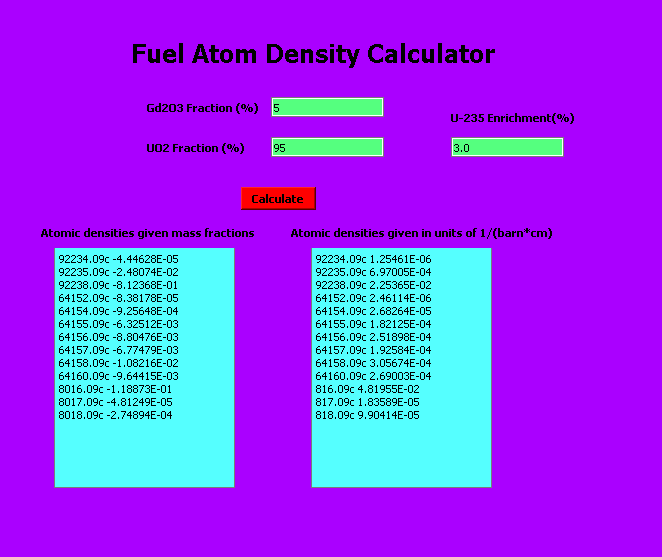

# Serpent-Fuel-Builder
A Python tool that reads isotope data from a JSON file and generates Serpent-compatible material definitions for fuel mixtures including uranium, gadolinium, and oxygen isotopes.

# Serpent Fuel Atom Density Calculator

This repository contains Python scripts for calculating isotopic atomic densities of nuclear fuel mixtures containing enriched UO₂ and Gd₂O₃ (Gadolinium oxide), based on natural isotopic abundances. The output atomic densities are formatted for use in Serpent reactor physics simulations.

---

## Description

The scripts utilize isotopic data from the NIST Atomic Weights and Isotopic Compositions database (`nistdataiso.json`) to compute atomic densities of uranium, gadolinium, and oxygen isotopes in fuel materials. These densities are critical inputs for accurate neutron transport simulations in Serpent.

There are two scripts provided:

- **Basic Model Script:**  
  Calculates normalized atomic densities using isotopic composition and molar masses only.  
  Reference: Serpent Manual Page 140.

- **Density-Aware Model Script:**  
  Incorporates material densities (g/cm³), Avogadro's number, and barn conversion to compute atomic densities in units of 1/(barn·cm). This script also saves the output to a text file.  
  Reference: Serpent Manual Page 51.

---

## Input Data

- `nistdataiso.json`:  
  JSON file containing isotopic data from NIST, including isotope symbol with mass number (e.g., "Gd 154"), relative atomic mass, and natural isotopic composition (abundance).

---

## Constants and Parameters

| Parameter          | Description                                   | Typical Value       |
|--------------------|-----------------------------------------------|--------------------|
| `gd2o3_frac`       | Weight percent of Gd₂O₃ in fuel mixture       | 5 or 8 (%)         |
| `uo2_frac`         | Weight percent of UO₂ in fuel mixture          | 95 or 92 (%)       |
| `gd2o3_molarmass`  | Molar mass of Gd₂O₃ (g/mol)                    | 362.5              |
| `uo2_molarmass`    | Molar mass of UO₂ (g/mol)                       | 270.03             |
| `gd2o3_density`    | Density of Gd₂O₃ (g/cm³) (used in density-aware script) | 7.41               |
| `uo2_density`      | Density of UO₂ (g/cm³) (used in density-aware script)   | 10.97              |
| `avagadro`         | Avogadro's number (atoms/mol)                   | 6.022×10²³         |
| `barn`             | Conversion factor (1 barn = 10⁻²⁴ cm²)          | 1.0×10⁻²⁴          |

---

## How the Scripts Work

1. Load isotopic data from `nistdataiso.json`.
2. For each isotope of Uranium, Gadolinium, and Oxygen:
   - Extract relative atomic mass and natural abundance.
   - Compute atomic density using isotopic fraction, material weight fractions, molar masses, densities, Avogadro's number, and barn conversion where applicable.
3. Output the atomic densities in Serpent input format, e.g.,  
   `92235.09c 5.62260E-04`
4. The density-aware script additionally writes the results into a file named  
   `serpent_fuel_atom_density_barn_output.txt`.

---

## Usage Instructions

1. Ensure that `nistdataiso.json` is located in the same directory as the scripts.
2. Run the Python script:

```bash
python serpent_fuel_density_calc.py
```
# Example Output Format
| Nuclide    | Atomic Density   |
|------------|-----------------|
| 92234.09c  | 4.29400E-06     |
| 92235.09c  | 5.62260E-04     |
| 92238.09c  | 2.05490E-02     |
| 64154.09c  | 4.61730E-05     |
| 64155.09c  | 2.97110E-04     |

## Output Locations
- Basic model: Printed on console  
- Density-aware model: Available in output file  

# References

- **Serpent Monte Carlo Reactor Physics Manual**, Pages 51 & 140

- **NIST Atomic Weights and Isotopic Compositions**  
  [https://www.nist.gov/pml/atomic-weights-and-isotopic-compositions-relative-atomic-masses](https://www.nist.gov/pml/atomic-weights-and-isotopic-compositions-relative-atomic-masses)

---

# Contact & License

If you have questions or feedback, feel free to open an issue or contact me directly.
